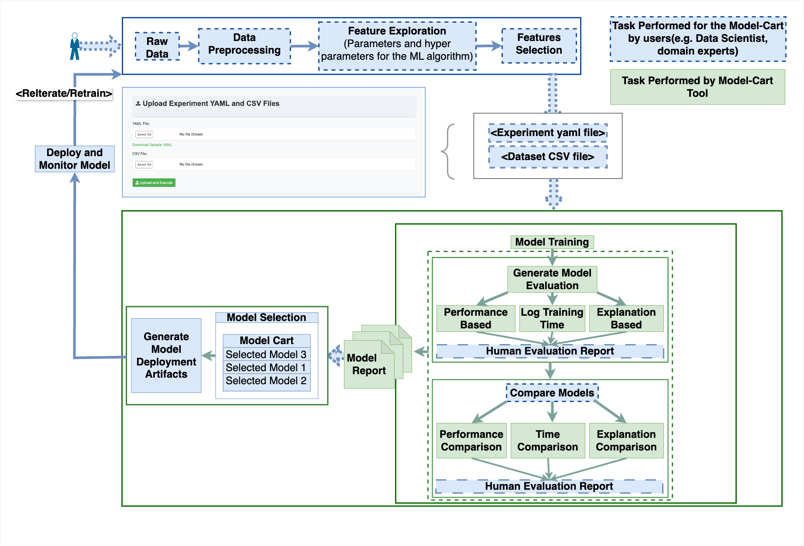

## Model_Cart

**Model Cart**: a comprehensive
open-source meta-framework that integrates explainability
methods, human intervention, and reproducibility.
By combining state-of-the-art approaches (currently with SHAP)
for model explainability, MLflow for reproducibility, and
human-in-the-loop approach, this work contributes to addressing
the challenges of transparency, trustworthiness, and
reliability in end-to-end model training. Model-Cart incorporates
explanations of model predictions, seamless integration
with popular ML libraries, and a custom built module based
on a novel method to quantify model explanation similarities
between ML models with an intuitive UI to facilitate
model training and evaluation with human-in-the-loop. It lets you:

- **Define & Launch Experiments**  
  Describe your runs with YAML configurations and CSV datasets; Model Cart parses your specs and kicks off training jobs with the specified parameters.

- **Monitor in Real Time**  
  Follow experiment progress through an interactive dashboard that updates run statuses and key metrics (e.g., accuracy, precision) as they train.

- **Inspect & Annotate Runs**  
  Drill down into individual runs to review start/end times, performance and efficiency data, and interpretability outputs—then attach your own domain notes.

- **Visualize & Compare Results**  
  Aggregate metrics across runs into charts and tables, compare models side-by-side, and explore feature-level explanations (e.g., via SHAP values).

- **Stage & Select Models**  
  Add your preferred runs to a “cart” for final review, refine notes or parameters, and prioritize the best candidates before deployment.

- **Package for Deployment**  
  With a single click, download a ZIP containing selected model artifacts and a comprehensive report, ready for production rollout.

Model Cart brings configuration, monitoring, analysis, comparison, and deployment prep into one intuitive interface—so you can focus on building better models, not juggling tools.  

## Architecture of Model_Cart

## Features
- User Authentication: Register, login, profile management and logout features.
- Experiment Management: Upload experiment files (YAML & CSV), and view experiment list.
- Experiment Comparison: Add runs to a comparison list and view aggregated results.
- Shopping Cart System: Add experiments to a cart, view cart contents, and remove items from cart.
- MLflow Integration: View details about individual runs, and fetch artifacts and metrics for comparisons.

## Getting Started

Installation Steps: 
1) Add virtual environment using Add New Interpreter. Activate virtual environment (run command "source venv/bin/activate" in terminal)
2) Run command "chmod +x install_requirements.sh" in terminal
3) Run command "./install_requirements.sh"
4) Run Serve_data_server.py
5) Run main.py
